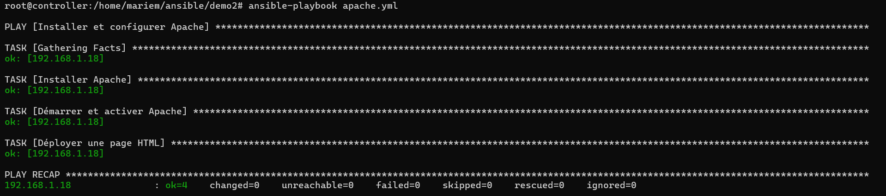
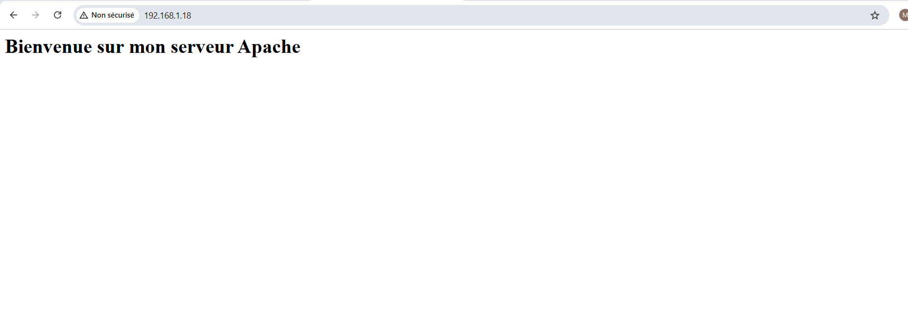
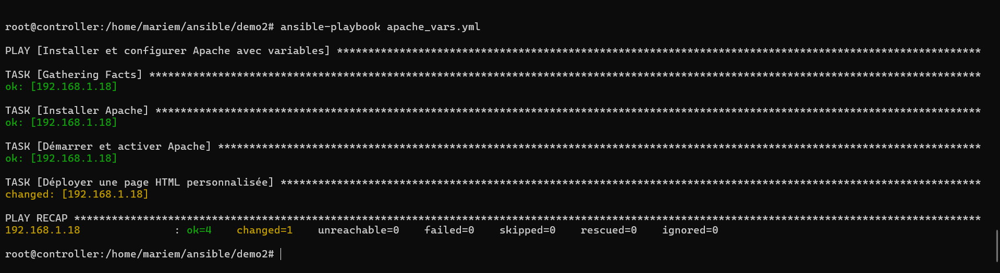
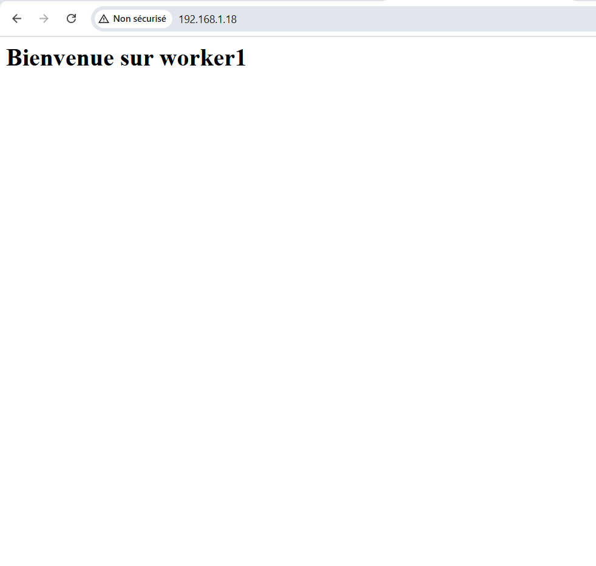

# TP3 & TP4 - Gestion d'Apache et des Variables avec Ansible

## Objectif
- TP3 : Installer et configurer le serveur Apache sur une machine distante via Ansible.
- TP4 : Utiliser les variables et les facts pour personnaliser les playbooks et afficher des informations système.

---

## Prérequis
- Une machine de contrôle avec Ansible installé.
- Une machine distante Ubuntu accessible via SSH.
- Inventaire Ansible configuré (`inventory.yml`).

---

## Structure du projet
TP3-4/
├── ansible.cfg # Configuration Ansible
├── inventory.yml # Inventaire des hôtes
├── apache.yml # Playbook pour installer et configurer Apache
├── apache_vars.yml # Variables spécifiques pour Apache
├── group_vars/ # Variables de groupe
└── README.md # Documentation du TP

---

## TP3 : Installation et Configuration Apache

### Playbook `apache.yml`
- Installe le paquet Apache (`apache2`).
- Démarre et active le service Apache.
- Copie un fichier de configuration ou un index.html personnalisé si nécessaire.

### Exécution

ansible-playbook apache.yml

Vérification
Accéder à l’adresse IP de la machine distante via un navigateur :

http://<IP_DISTANTE>
Vous devriez voir la page HTML affichant "Bienvenue sur mon serveur Apache".

# TP4 : Gestion des Variables et Facts

## Objectif
Apprendre à utiliser les variables et les ansible_facts pour rendre les playbooks dynamiques.

## Étapes principales
1. Définir des variables dans le playbook `apache_vars.yml`.
2. Créer un fichier de variables externes dans `group_vars/webservers.yml`.
3. Afficher les informations système avec `ansible_facts`.
4. Exécuter le playbook :

ansible-playbook apache_vars.yml

Vérification
Ouvrir un navigateur sur l'IP de la machine distante :
Vous devriez voir la page HTML personnalisée avec le hostname.

