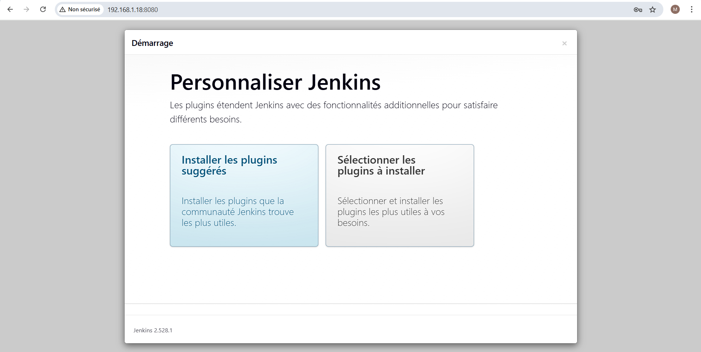
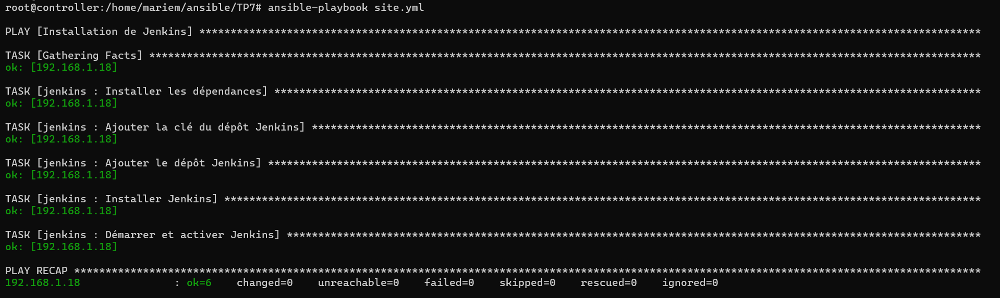

## TP7 : Installation de Jenkins avec un Rôle Ansible

## Objectif

Automatiser l’installation et la configuration de Jenkins sur un serveur Linux en utilisant un rôle Ansible.

## Étapes principales

1. Création du rôle Jenkins

Créer un rôle dédié pour gérer toutes les étapes d’installation et de configuration de Jenkins.

2. Définition des variables

Définir les variables nécessaires, comme le dépôt Jenkins, le paquet à installer, le service et le port d’écoute.

3. Création des tâches

Installer les dépendances requises (Java, outils de transport HTTPS, etc.)

Ajouter la clé et le dépôt Jenkins

Installer Jenkins

Démarrer et activer le service Jenkins

4. Configuration des handlers

Créer un handler pour redémarrer Jenkins si nécessaire.

Vérification de l’installation
Tester si Jenkins fonctionne en accédant à l’URL du serveur sur le port configuré.

5. Utilisation du rôle dans un playbook
Créer un playbook principal pour inclure le rôle Jenkins et le déployer sur les serveurs ciblés.

6. Exécution du playbook
Lancer le playbook et vérifier l’installation sur la machine distante via un navigateur.

