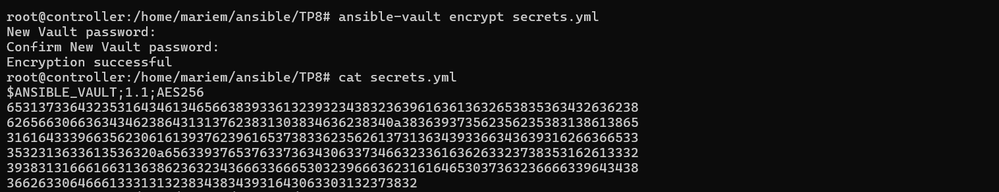

## TP8 : Gestion des Secrets avec Ansible Vault

## Objectif

Apprendre à sécuriser les mots de passe et autres informations sensibles dans les playbooks Ansible en utilisant Ansible Vault.

# Étapes principales

1. Création d’un fichier sensible

Créer un fichier pour stocker des informations sensibles, comme un mot de passe ou un utilisateur de base de données.

2. Chiffrement avec Ansible Vault
Chiffrer le fichier pour le protéger et empêcher que son contenu soit visible en clair.

3. Utilisation du fichier chiffré dans un playbook
Inclure le fichier chiffré dans un playbook pour utiliser les variables sécurisées lors du déploiement.

4. Exécution du playbook
Lancer le playbook avec l’option --ask-vault-pass pour fournir le mot de passe et permettre l’accès aux secrets.

5. Modification d’un fichier chiffré
Utiliser ansible-vault edit pour modifier temporairement le fichier chiffré puis le sauvegarder.
6. Ré-encryptage
Utiliser ansible-vault rekey si besoin de changer le mot de passe de chiffrement du fichier.

